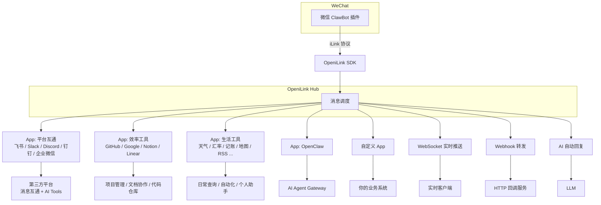
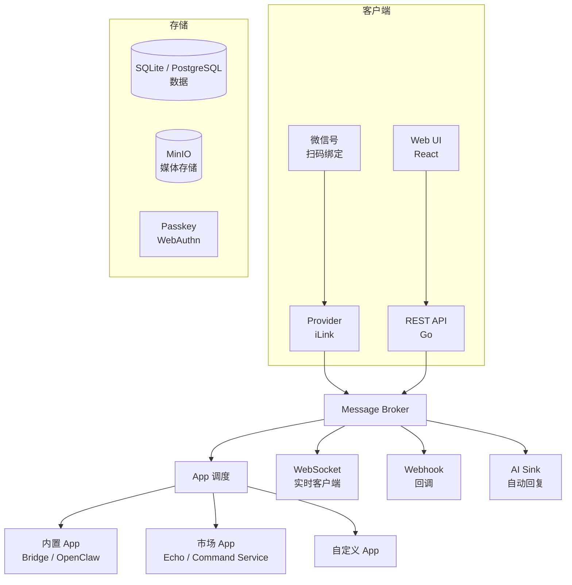

> **免责声明**：本项目基于公开的 iLink 协议进行独立开发，仅供学习交流与技术研究使用。项目与 iLink 协议的官方团队无任何关联或授权关系。若相关权利方认为本项目存在侵权，请通过 Issue 联系我们，我们将在确认后第一时间予以下架处理。
>
> **Disclaimer:** This project is independently developed based on the publicly available iLink protocol for learning and research purposes only. It is not affiliated with or endorsed by the official iLink team. If any rights holder believes this project infringes upon their rights, please contact us via an Issue and we will take it down promptly upon confirmation.

<div align="center">

<picture>
  <source media="(prefers-color-scheme: dark)" srcset="https://raw.githubusercontent.com/openilink/openilink.com/main/brand/logo-white.svg">
  <source media="(prefers-color-scheme: light)" srcset="https://raw.githubusercontent.com/openilink/openilink.com/main/brand/logo-black.svg">
  
</picture>

<br><br>

**微信 ClawBot iLink 协议的开源消息管理平台 + App 应用市场**<br>
**Open-source message management platform + App Marketplace for WeChat ClawBot (iLink protocol)**

扫码绑定微信号，通过应用市场一键扩展能力 —— 飞书 / Slack / Discord / GitHub / Notion 等 20+ App，装上就用<br>
多 Bot 管理 · 20+ App · 平台互通 · 效率工具 · 生活助手 · AI Tools · 7 种语言 SDK · Passkey 登录

[](LICENSE)
[](https://go.dev)
[](https://react.dev)
[](https://hub.docker.com/r/openilink/openilink-hub)
[](https://github.com/openilink/openilink-hub/stargazers)
[](https://github.com/openilink/openilink-hub/releases)

[官网 & 文档](https://openilink.com) · [在线体验](https://hub.openilink.com) · [快速开始](#快速开始) · [应用市场](#app-应用市场) · [SDK](#sdk-生态) · [English](#english)

</div>

---

## 快速开始

```bash
# 一键安装（Linux / macOS）
curl -fsSL https://raw.githubusercontent.com/openilink/openilink-hub/main/install.sh | sh

# 启动
oih

# 或者用 Docker（二选一）
docker run -d -p 9800:9800 openilink/openilink-hub:latest              # Docker Hub
# 或者 / or:
docker run -d -p 9800:9800 ghcr.io/openilink/openilink-hub:latest     # GHCR
```

打开 `http://localhost:9800`，注册账号（**第一个注册的自动当管理员**），扫码绑定微信号，完事。

> 默认用 SQLite，不用装数据库，不用配任何东西。想用 PostgreSQL？设个 `DATABASE_URL` 就行。

<a id="windows"></a>
> **Windows 用户**：原生 Windows 不支持，请用以下任一方式：
> - **Docker（推荐）**：`docker run -d -p 9800:9800 openilink/openilink-hub:latest`
> - **WSL2**：在 WSL 的 Ubuntu/Debian 里按上面的 Linux 方式跑

---

## 这是什么？

2026 年 3 月微信推出了 **ClawBot 插件**，底层叫 **iLink（智联）** 协议 —— 第一次官方允许你用程序收发微信消息。

但 iLink 只是个原始通道：能收消息、能发回复，没了。你还得自己处理 context_token、CDN 加密、24 小时过期、多 Bot 管理……

**OpeniLink Hub 把这些全包了**，并且通过 **App 应用市场** 让你一键扩展功能：

- 扫码绑定，Web 后台管理多个 Bot
- 应用市场一键装功能 —— 对接飞书 / Slack / GitHub / Notion，查天气、记账、AI 对话，不用写代码
- WebSocket / Webhook / AI 三个通道同时转发消息到你的服务
- 24 小时窗口到期前提醒，避免错过续期
- 消息链路追踪，出问题一眼看到卡在哪



<details>
<summary><b>和 OpenClaw 什么关系？</b></summary>

OpenClaw 是 AI Agent 框架，OpeniLink Hub 是消息管理平台，两个东西。

在 Hub 里，OpenClaw 是一个**内置 App** —— 在应用市场一键启用就行。当然你也可以完全不用 OpenClaw，选别的 App 或直接用 WebSocket/Webhook 对接你自己的服务。

简单说：**OpenClaw 管 AI 逻辑，Hub 管消息收发和 App 分发**，各干各的，想连就连。

</details>

## 为什么用 Hub？

### 自己对接 iLink 会遇到这些问题

| 你遇到的问题 | Hub 怎么解决 |
|---|---|
| iLink 没有官方文档，全靠社区逆向 | 完善中文文档 + 7 种语言 SDK |
| context_token 管理复杂，消息经常发不出去 | SDK 自动处理，你只管收消息发回复 |
| 24 小时过期掉线，重要消息丢了 | 到期前提醒 + 消息持久化 |
| 发图片要自己搞 CDN 上传 + AES 加密 | 一行代码发图片视频文件 |
| 只能命令行操作，管不了多个 Bot | Web 控制台，扫码绑定、状态监控、消息追踪 |
| 想加功能得自己写代码 | 应用市场一键安装，不写代码也能扩展 |

### 和其他开源项目比

GitHub 上有不少 iLink 相关的开源项目，但大多是底层 SDK 或 Agent 桥接工具。Hub 是目前唯一带**管理后台 + 应用市场 + 多通道分发**的完整平台。

| | OpeniLink Hub | 其他方案 |
|---|---|---|
| **定位** | 完整消息管理平台 | SDK / Agent 桥接器 |
| **应用市场** | 有，一键装功能，支持社区 App | 无 |
| **Web 后台** | 完整控制台 + 消息追踪 | 无 / 仅配置面板 |
| **消息分发** | App + WebSocket + Webhook + AI 并行 | 单一通道 |
| **SDK** | 7 种语言 | 1~4 种 |
| **部署** | 一行命令，内置 SQLite 零配置 | 需要外部数据库 |
| **OpenClaw 依赖** | 完全独立（可选适配） | 部分强依赖 |

## 核心特性

**App 应用市场** · 不写代码也能扩展 Bot。20+ 官方 App 覆盖平台互通（飞书、Slack、Discord、钉钉、企业微信）、效率工具（GitHub、Google Workspace、Notion、Linear）、生活工具（天气、汇率、记账、地图、RSS）等场景。通过 PKCE OAuth 安全安装，支持第三方开发者上架。

**多 Bot 管理** · 扫码绑定多个微信号，统一面板看状态，到期前提醒防掉线。

> 说明：微信 24 小时窗口目前不能由 Hub 在后台静默自动续期。Hub 现在支持的是“到期前提醒”，会在窗口快到期时提醒你回一条消息，收到回复后窗口会重新开始计时。

**多通道消息下发**
- **App** — 已安装的 App 自动接收匹配的消息，通过 WebSocket 或 Webhook 投递
- **WebSocket** — 毫秒级实时推送
- **Webhook** — HTTP 回调，对接任意服务
- **AI 自动回复** — 接入 OpenAI 兼容 API，Bot 自动对话

**消息追踪** · 每条消息从收到到投递的完整链路，哪一步耗时多少一目了然，出问题快速定位。

**Passkey 登录** · 指纹、Face ID、硬件密钥直接登录，也支持 GitHub / LinuxDo OAuth。

**管理后台** · 用户管理、角色权限、OAuth 配置、AI 全局设置、App 管理，一站式掌控。

## App 应用市场

Hub 的核心扩展机制。每个 App 是一个独立服务，通过标准协议与 Hub 交互。

### 能装什么？

**平台互通** — 微信与第三方平台双向消息互通 + AI Tools 自然语言操作

| 应用 | 能干什么 |
|------|---------|
| **Lark（飞书）** 🔥 | 消息互通 + 34 个 AI Tools，覆盖日历、云文档、任务、通讯录、多维表格、邮箱、知识库、视频会议等 11 大业务域 |
| **Slack** | 消息互通 + 23 个 AI Tools，管理频道、消息、用户、文件、提醒、书签 |
| **Discord** | 消息互通 + 19 个 AI Tools，管理频道、成员、Embed、服务器 |
| **DingTalk（钉钉）** | 消息互通 + 20 个 AI Tools，覆盖通讯录、日程、待办、审批、考勤、钉盘 |
| **WeCom（企业微信）** | 消息互通 + 18 个 AI Tools，覆盖通讯录、日程、审批、打卡、微盘、客户联系 |

**效率工具** — 在微信里用自然语言操作主流 SaaS 平台

| 应用 | 能干什么 |
|------|---------|
| **GitHub** | 36 个 AI Tools，管理 Issue、PR、Repo、Actions、Release、Gist |
| **Google Workspace** | 18 个 AI Tools，操作 Gmail、Calendar、Drive、Docs、Sheets |
| **Notion** | 15 个 AI Tools，管理页面、数据库、评论、搜索 |
| **Linear** | 13 个 AI Tools，管理 Issue、项目、团队、Cycle |

**生活工具** — 轻量实用，零配置或免费 API 即可运行

| 应用 | 能干什么 |
|------|---------|
| **Amap（高德地图）** | 10 个 AI Tools，POI 搜索、路线规划、天气、地理编码 |
| **Weather（天气）** | 全球城市天气 + 空气质量查询 |
| **Currency（汇率）** | 30+ 货币实时汇率换算 |
| **Expense（记账）** | 微信记账 + 月报 + 分类统计 |
| **Reminder（提醒）** | 一次性 / 重复 / Cron 定时提醒 |
| **Cron（定时任务）** | Cron 调度 + 自动消息推送 |
| **RSS** | RSS 订阅，新文章自动推送到微信 |
| **QRCode（二维码）** | 二维码生成与解码，纯本地运算 |

**开发者 & 基础设施**

| 应用 | 能干什么 |
|------|---------|
| **Command Service** | `/s 600519` 查股价、`/gi 赛博朋克城市` 生成图片、`/a 帮我写邮件` AI 对话，20+ 命令 |
| **OpenClaw** | 让 OpenClaw AI Agent 直接通过微信聊天 |
| **Runner** | 把本地 CLI 命令暴露为微信可调用的 App Tools |
| **Bridge** | 微信消息自动转发到你自己的服务器 |
| **Echo** | 开发者模板，3 分钟上手写自己的 App |

### App 类型

| 类型 | 说明 | 示例 |
|------|------|------|
| **内置 App** | 随 Hub 一起提供，无需额外部署 | Bridge、OpenClaw |
| **市场 App** | 从远程 Registry 安装 | Lark、GitHub、Weather 等 20+ |
| **自定义 App** | 你自己开发的 | 你的业务系统 |

### 怎么装？

1. 在 Hub 后台进入「应用市场」
2. 看到想要的 App，点「安装」
3. 通过 PKCE OAuth 完成授权
4. App 开始接收消息，完事

### 怎么开发？

App 通过以下方式与 Hub 交互：

- **接收事件**：WebSocket 连接或 Webhook 回调
- **定义命令**：声明 tools 和 commands，用户通过 `/命令` 或 `@提及` 触发
- **发送回复**：调用 Hub API 发消息

参考 [openilink-app-echo](https://github.com/openilink/openilink-app-echo) 快速上手。

#### Mock Server（本地开发调试）

不用跑真实 Hub + 微信 Bot，用 Mock Server 在本地开发和测试 App：

```bash
# 启动 Mock Server，将事件通过 Webhook 投递到你的 App
go run ./cmd/appmock --webhook-url http://localhost:8080/webhook

# 注入一条模拟消息，触发你的 App
curl -X POST http://localhost:9801/mock/event \
  -d '{"sender":"alice","content":"@test-app hello"}'

# 查看你的 App 发了什么消息
curl http://localhost:9801/mock/messages
```

Mock Server 复用真实的 Bot API handler，行为与生产环境完全一致。完整文档见 [`docs/mock-server.md`](docs/mock-server.md)。

## 架构总览



## 部署指南

### 数据存储

默认 SQLite，零配置。数据文件位置：
- Linux: `~/.local/share/openilink-hub/openilink.db`
- macOS: `~/Library/Application Support/openilink-hub/openilink.db`
- root/service: `/var/lib/openilink-hub/openilink.db`

设置 `DATABASE_URL=postgres://...` 切换到 PostgreSQL。

### 注册为系统服务

```bash
oih install       # 安装 systemd (Linux) / launchd (macOS) 服务
oih uninstall     # 卸载服务
```

### Docker Compose（生产环境）

适合需要 PostgreSQL + MinIO 的场景：

```yaml
services:
  postgres:
    image: postgres:17-alpine
    environment:
      POSTGRES_USER: openilink
      POSTGRES_PASSWORD: <改为强密码>
      POSTGRES_DB: openilink
    volumes:
      - pgdata:/var/lib/postgresql/data

  hub:
    image: openilink/openilink-hub:latest  # 或 ghcr.io/openilink/openilink-hub:latest
    ports:
      - "9800:9800"
    environment:
      DATABASE_URL: postgres://openilink:<密码>@postgres:5432/openilink?sslmode=disable
      RP_ORIGIN: https://hub.example.com
      RP_ID: hub.example.com
      SECRET: <随机字符串>
    depends_on:
      - postgres

volumes:
  pgdata:
```

前面放个 Nginx / Caddy 做 HTTPS 反代就行。

### 从源码构建

```bash
cd web && pnpm install && pnpm run build && cd ..
go build -o oih .
./oih
```

## CLI 命令

| 命令 | 说明 |
|------|------|
| `oih` | 前台运行 |
| `oih install` | 装成系统服务 |
| `oih uninstall` | 卸载系统服务 |
| `oih version` | 看版本 |

## SDK 生态

7 种语言，挑你熟悉的用：

| 语言 | 安装 |
|------|------|
| **Go** | `go get github.com/openilink/openilink-sdk-go` |
| **Node.js** | `npm install @openilink/openilink-sdk-node` |
| **Python** | `pip install openilink-sdk-python` |
| **PHP** | `composer require openilink/openilink-sdk-php` |
| **Java** | [openilink-sdk-java](https://github.com/openilink/openilink-sdk-java)（从源码构建） |
| **C#** | [openilink-sdk-csharp](https://github.com/openilink/openilink-sdk-csharp)（开发中） |
| **Lua** | [openilink-sdk-lua](https://github.com/openilink/openilink-sdk-lua)（从源码引入） |

### 相关项目

**App**（完整列表见 [应用市场](#能装什么)）

| 项目 | 说明 |
|------|------|
| [openilink-app-lark](https://github.com/openilink/openilink-app-lark) | 飞书 · 34 AI Tools 🔥 |
| [openilink-app-slack](https://github.com/openilink/openilink-app-slack) | Slack · 23 AI Tools |
| [openilink-app-discord](https://github.com/openilink/openilink-app-discord) | Discord · 19 AI Tools |
| [openilink-app-dingtalk](https://github.com/openilink/openilink-app-dingtalk) | 钉钉 · 20 AI Tools |
| [openilink-app-wecom](https://github.com/openilink/openilink-app-wecom) | 企业微信 · 18 AI Tools |
| [openilink-app-github](https://github.com/openilink/openilink-app-github) | GitHub · 36 AI Tools |
| [openilink-app-google](https://github.com/openilink/openilink-app-google) | Google Workspace · 18 AI Tools |
| [openilink-app-notion](https://github.com/openilink/openilink-app-notion) | Notion · 15 AI Tools |
| [openilink-app-linear](https://github.com/openilink/openilink-app-linear) | Linear · 13 AI Tools |
| [openilink-app-echo](https://github.com/openilink/openilink-app-echo) | App 开发模板 |

> 更多 App：[amap](https://github.com/openilink/openilink-app-amap) · [weather](https://github.com/openilink/openilink-app-weather) · [currency](https://github.com/openilink/openilink-app-currency) · [expense](https://github.com/openilink/openilink-app-expense) · [reminder](https://github.com/openilink/openilink-app-reminder) · [cron](https://github.com/openilink/openilink-app-cron) · [rss](https://github.com/openilink/openilink-app-rss) · [qrcode](https://github.com/openilink/openilink-app-qrcode) · [command-service](https://github.com/openilink/openilink-app-command-service) · [runner](https://github.com/openilink/openilink-app-runner)

**其他**

| 项目 | 说明 |
|------|------|
| [openclaw-channels](https://github.com/openilink/openclaw-channels) | OpenClaw 渠道插件 |
| [openilink-tg](https://github.com/openilink/openilink-tg) | 微信消息转发到其他平台 |
| [openilink-webhook-plugins](https://github.com/openilink/openilink-webhook-plugins) | 官方 Webhook 插件仓库 |

## 环境变量

| 变量 | 默认值 | 说明 |
|------|--------|------|
| `LISTEN` | `:9800` | 监听地址 |
| `DATABASE_URL` | SQLite | 不设就用 SQLite，设 `postgres://...` 切 PostgreSQL |
| `RP_ORIGIN` | `http://localhost:9800` | 站点地址，必须和浏览器访问的一样 |
| `RP_ID` | `localhost` | WebAuthn RP ID，填域名 |
| `SECRET` | `change-me-in-production` | 服务端密钥，**生产必须改** |
| `REGISTRY_URL` | — | 远程 App Registry 地址 |
| `REGISTRY_ENABLED` | `true` | 是否启用远程 Registry |
| `GITHUB_CLIENT_ID` | — | GitHub OAuth |
| `GITHUB_CLIENT_SECRET` | — | GitHub OAuth |
| `LINUXDO_CLIENT_ID` | — | LinuxDo OAuth |
| `LINUXDO_CLIENT_SECRET` | — | LinuxDo OAuth |
| `STORAGE_ENDPOINT` | — | MinIO / S3 端点 |
| `STORAGE_ACCESS_KEY` | — | 存储密钥 |
| `STORAGE_SECRET_KEY` | — | 存储密钥 |
| `STORAGE_BUCKET` | — | 存储桶 |
| `STORAGE_PUBLIC_URL` | — | 存储公开 URL |

<details>
<summary><b>配置 OAuth 登录</b></summary>

**GitHub OAuth**

1. [GitHub Developer Settings](https://github.com/settings/developers) → OAuth Apps → New OAuth App
2. Homepage URL: `https://hub.example.com`
3. Callback URL: `https://hub.example.com/api/auth/oauth/github/callback`
4. 拿到 Client ID 和 Secret，填环境变量

**LinuxDo OAuth**

1. [connect.linux.do](https://connect.linux.do) 创建应用
2. 回调地址: `https://hub.example.com/api/auth/oauth/linuxdo/callback`
3. 填环境变量

> 回调地址格式：`{RP_ORIGIN}/api/auth/oauth/{provider}/callback`

</details>

## 技术栈

| 层 | 技术 |
|----|------|
| 后端 | Go 1.25, SQLite / PostgreSQL 17, gorilla/websocket |
| 前端 | React 19, Vite, TypeScript, Tailwind CSS |
| 认证 | WebAuthn (Passkey), OAuth 2.0 (PKCE), 密码 |
| App 系统 | PKCE OAuth 安装, WebSocket/Webhook 事件投递 |
| 存储 | MinIO / S3（可选） |
| 部署 | 单文件二进制 / Docker ([Docker Hub](https://hub.docker.com/r/openilink/openilink-hub) / [GHCR](https://github.com/openilink/openilink-hub/pkgs/container/openilink-hub)) / Docker Compose |

## 参与贡献

欢迎提 Issue 和 PR！

- App 开发参考 [openilink-app-echo](https://github.com/openilink/openilink-app-echo)
- 插件提交到 [openilink-webhook-plugins](https://github.com/openilink/openilink-webhook-plugins)
- SDK 问题到对应语言仓库

## License

[MIT](LICENSE) — 随便用，不限商用。

---

<div align="center">

**[OpeniLink](https://openilink.com)** · 让微信 Bot 接入更简单

</div>

---

<a name="english"></a>

## English

**OpeniLink Hub** is a self-hosted, open-source WeChat Bot management and message relay platform built on top of the **iLink protocol** — WeChat's first official Bot API, launched in March 2026.

It wraps WeChat's raw messaging into a complete system: bind multiple accounts via QR code, install apps from the marketplace to add features like stock queries and image generation, forward messages through WebSocket / Webhook / AI auto-reply — all managed from a web dashboard.

### Key Highlights

- **App Marketplace (20+)** — Platform integration (Lark, Slack, Discord, DingTalk, WeCom), productivity (GitHub, Google Workspace, Notion, Linear), utilities (weather, expense, RSS, maps...), all with AI Tools
- **Multi-bot management** — Bind and manage multiple WeChat accounts, auto session renewal
- **Message tracing** — Full delivery timeline for every message, pinpoint issues instantly
- **Multi-channel delivery** — Apps, WebSocket, Webhook, and AI auto-reply in parallel
- **Passkey (WebAuthn)** — Passwordless login with biometric / hardware key support
- **Built-in SQLite** — Zero-config database with optional PostgreSQL
- **7 language SDKs** — Go, Node.js, Python, PHP, Java, C#, Lua

### Quick Start

```bash
# One-line install
curl -fsSL https://raw.githubusercontent.com/openilink/openilink-hub/main/install.sh | sh

# Start
oih

# Or use Docker (either registry works)
docker run -d -p 9800:9800 openilink/openilink-hub:latest              # Docker Hub
# or:
docker run -d -p 9800:9800 ghcr.io/openilink/openilink-hub:latest     # GHCR
```

Visit `http://localhost:9800` — first user becomes admin. Zero config needed.

**Website:** [openilink.com](https://openilink.com) · **Live Demo:** [hub.openilink.com](https://hub.openilink.com)
